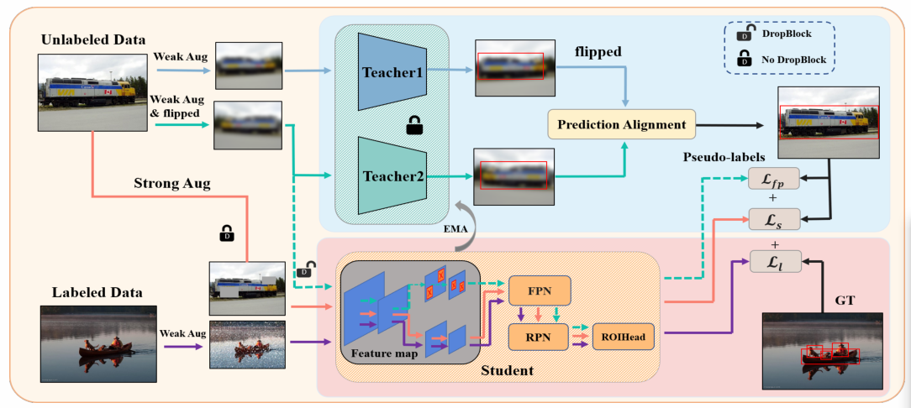

# DTAB-SSOD: Dual-Teacher Fusion with Augmented Branch for Semi-Supervised Object Detection

Semi-supervised object detection aims to leverage unlabeled data to improve detection performance while reducing annotation costs. However, existing methods suffer from low-quality pseudo-labels and limited feature learning capabilities. We propose **DTAB-SSOD**, a novel dual-teacher fusion framework with feature augmentation branch that significantly improves pseudo-label quality and model robustness.

Our approach introduces two key innovations. (1) A **dual-teacher fusion module** that employs two teacher models processing original and horizontally flipped images to increase prediction diversity, coupled with a sophisticated prediction alignment strategy for confidence-weighted pseudo-label fusion. (2) A **feature augmentation branch** that applies DropBlock perturbations to intermediate feature maps, creating additional supervision signals at the feature level beyond conventional image-level augmentation.

Extensive experiments on PASCAL VOC and MS-COCO datasets demonstrate the effectiveness of our method. On PASCAL VOC, DTAB-SSOD achieves 81.44% AP50 and 55.30% AP50:95, outperforming the state-of-the-art Unbiased Teacher by 4.07% and 6.61% respectively. On MS-COCO with various labeled ratios (1%-10%), our method consistently surpasses existing approaches, validating its effectiveness across different data scarcity scenarios.

*Figure 1: Overall framework of DTAB-SSOD*

## Requirements

- Python 3.8.1
- PyTorch >= 1.7.0
- CUDA >= 10.1